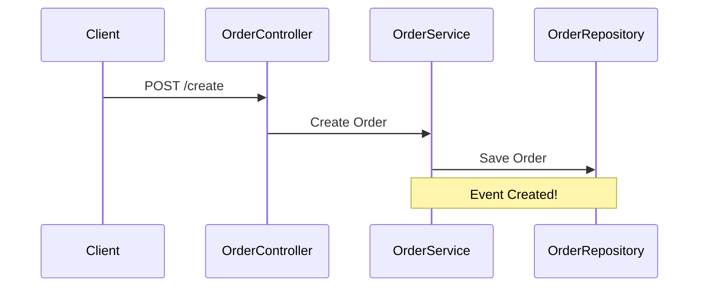
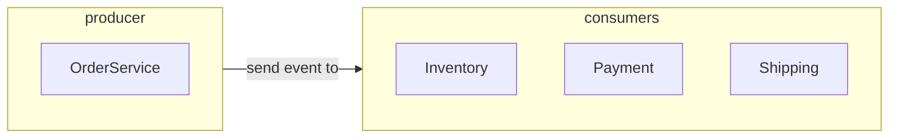

# Messaging with Kafka and Spring Boot

  

### **Para visualizar os diagramas talvez será necessário ter instalado em seu browser alguma extensão que permita visualizar diagramas mermaid.**

  

### Tecnologias

  

- Java

- Spring Boot

- Docker Compose

- Postgres

- Kafka

- ZooKeeper

  

### Sobre esse projeto:

  

A ideia desse projeto foi de aprender mais sobre Messaging no Spring Boot, e para isso acabei escolhendo o [Kafka](https://kafka.apache.org) como Message Broker, e junto dele também utilizei o [ZooKeeper](https://zookeeper.apache.org) como um serviço de coordenação para o Kafka. No banco de dados optei por ir com o [Postgres](https://www.postgresql.org) por preferência pessoal mesmo, e para visualização do banco de dados durante o desenvolvimento utilizei o [DBeaver](https://dbeaver.io).

  

No Docker Compose utilizei a dependência do Spring chamada Docker Compose Support, com ela não foi necessário adicionar configurações a mais no `resources/application.properties`.

  

Esse projeto foi criado para apenas aprender e praticar o básico do Kafka, então não possui uma estrutura elaborada/complexa pois a ideia foi em manter as coisas simples.

  

O projeto se trata de uma pequena api de pedidos, nela você pode apenas criar e listar os pedidos (novamente a intenção era apenas testar um pouco o Kafka :x), e ao criar um pedido eventos serão disparados para três Consumers, sendo eles `InventoryService`, `PaymentService`, `ShippingService` eles estarão de olho nos respectivos tópicos para saber quando uma order foi criada.

  

Estrutura da api:

  



  

Segui um padrão de Clean Architecture dividindo as camadas por responsabilidades e dependências do projeto. O evento do Kafka é acionado na camada de Service (Casos de uso) logo após a order ser criada e adicionada no Banco de dados. Lembrando que nesse caso existem apenas duas operações no `OrderService` sendo elas a de create e list, respectivamente uma é responsável por criar uma order e a outra por listar as orders.

  

Producer e Consumers:

  



O producer da api é o OrderService, responsável por criar os eventos após uma order ser criada, e os consumers estão "subscritos" nos tópicos relacionados à order criada, a ideia foi simular um sistema real de pedidos, de forma bem simplificada.

  

### Como executar:

  

Algumas coisas serão necessárias:

  

**!!! Importante para o kafka funcionar com o zookeeper é necessário adicionar o hostname `kafka` na pasta etc/hosts, a localização dessa pasta pode variar de OS para OS, no Windows fica em `C:\Windows\System32\drivers\etc` lembre-se que para editar o arquivo hosts deve-se abrir como administrador !!!**

  

- Clonar o repositório git

- Executar o docker-compose

  

```
docker-compose up
```

  

- Contruir o projeto

  

```
mvn clean package
```

  

- Executar a aplicação:

  

```
java -jar target/kafka-0.0.1-SNAPSHOT.jar
```

  

- Enviando requisição post para o endpoint `order/create` utilizando [httpie](https://httpie.io):

```
http :8080/order/create orderItem="Order" orderPrice=100.5 orderAddress="Address One" orderPayment="credit"
```

  

- Endpoint list

  

```
http :8080/order/list
```

  

- A resposta deve ser:

  

```
HTTP/1.1 201

Connection: keep-alive

Content-Type: application/json

Date: Thu, 10 Aug 2023 05:07:36 GMT

Keep-Alive: timeout=60

Transfer-Encoding: chunked

  

{

    "orderAddress": "Address One",

    "orderItem": "Order",

    "orderPayment": "credit",

    "orderPrice": 100.5

}
```

  

- E no console deve aparecer a resposta dos consumers simbolizando que receberam os eventos

```
A forma de pagamento é: credit

O endereço de envio é: Address One

O item pedido: Order está em estoque!
```

Ao receber as mensagens no console conclui-se que todos os Consumers que estavam "subscritos" nos tópicos relacionados a criação de uma order receberam a notificação de que uma order foi de fato criada, e também receberam o body da requisição post, sendo assim serão capazes de realizar operações com essa order que receberam, nesse caso a operação é apenas um `println` com as informações relevantes para cada serviço, porém poderiam ter operações mais complexas que se aplicasem as regras de negócio desses serviços.
